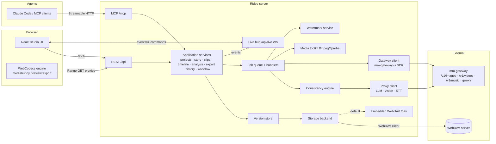

# Architecture

## Goals and constraints

1. Assets are managed on **WebDAV**, so any WebDAV client or storage product can hold, browse and edit a
   project.
2. **Character consistency is guaranteed**: no take reaches an approved clip or an export unless its
   characters were verified against locked references, or a human recorded an explicit override.
3. Every document change is **versioned** (who, when, why) and can be diffed and restored.
4. Image, video and music generation uses the **mm-gateway JS SDK**. Every other AI request (LLM, vision
   judge, speech-to-text) goes through the **mm-gateway reverse proxy**.
5. Agents control the studio through **MCP**, and every change shows up **live** in open browsers.
6. Generated media carries an **invisible, keyed watermark** plus provenance metadata.
7. Editing runs in the browser with **WebCodecs**, and the server renders long movies with ffmpeg.

## System overview



### Layers

| Layer | Package / module | Responsibility |
|---|---|---|
| Domain model | `packages/shared/src/schemas` | zod schemas for every document, event and API payload. They are the single source of truth for types. |
| Pure logic | `packages/shared/src/{timeline,workflow,prompt,watermark,diff}` | Timeline reducers, workflow stage tables, the deterministic prompt compiler, the watermark core (DCT embed/extract). No I/O, unit-tested, used by server and browser. |
| Application services | `packages/server/src/domain` | Use cases (create project, approve gate, generate clip…). Each takes an `Actor`, writes through the version store and emits live events. REST and MCP both call these. |
| Infrastructure | `packages/server/src/{storage,vcs,media,gateway,ai,jobs,watermark,live}` | WebDAV I/O, commits, ffmpeg, SDK/proxy clients, job execution, watermarking, WebSocket fan-out. |
| Surfaces | `packages/server/src/http`, `packages/server/src/mcp` | REST routes and MCP tools: thin adapters that validate input and call services. |
| UI | `packages/web` | Studio UI. Its state is a projection of server documents, updated by live events. |

## Data flow of a change

1. A surface (REST route, MCP tool, job handler, or WebDAV sync) calls a service method with an `Actor`.
2. The service takes the project's write lock, validates, and writes documents with `repo.commit()`. That
   stores content-addressed objects and moves the branch ref. See [version-control](design/version-control.md).
3. The work tree materializer writes human-readable copies of the changed documents to the project folder on
   WebDAV.
4. The live hub publishes `{kind: "commit", commit, docs}` to every subscribed browser session, with a
   per-project sequence number. See [realtime-sync](design/realtime-sync.md).
5. The browser store replaces the changed documents and React re-renders. Nothing is refetched unless a
   sequence gap is detected.

Long-running work (LLM calls, generation, ffmpeg) runs as **jobs**. Jobs publish `job` events for progress
and commit their results like any other actor (`system`, on behalf of the requesting actor).

## Technology choices

| Concern | Choice | Why |
|---|---|---|
| Language | TypeScript everywhere (Node 24 server, browser UI) | One type system; schemas and pure logic are shared between server and browser. |
| HTTP server | Fastify 5 + `@fastify/websocket` | Fast, schema-friendly, first-class `inject()` for tests. |
| Validation | zod 4 | Runtime validation at every boundary; MCP tool schemas come from the same definitions. |
| WebDAV client | `webdav` (perry-mitchell) | Mature client with streaming and ranges. |
| Embedded WebDAV | `webdav-server` v2 mounted at `/dav` via the HTTP server factory | Works with Finder, Explorer and davfs out of the box. |
| AI generation | `@sloth-os/mm-gateway-js` (OpenAPI SDK, pinned git dependency) | Required by the product constraints. |
| Other AI | `fetch` against `${MM_GATEWAY_URL}/proxy/{domain}/{path}` | Required by the product constraints. Supports streaming and abort. |
| MCP | `@modelcontextprotocol/sdk` Streamable HTTP transport | Supported by Claude Code, Codex, Cursor and others; stdio-only clients can use `mcp-remote`. |
| Media processing | ffmpeg/ffprobe (child processes) | Decode/encode, analysis filters, rendering, raw-frame pipes for watermarking. |
| Browser media | WebCodecs via mediabunny | Frame-accurate decode and hardware-accelerated encode with a pure-TS demux/mux layer. |
| UI | React 19, Vite 8, Tailwind 4, zustand, react-router | Lightweight SPA; zustand store driven by live events. |
| Tests | Vitest (unit + integration), Playwright (e2e) | One runner for Node and jsdom, and a browser matrix for e2e. |
| Lint/format | Biome | A single fast tool. |

## Repository layout

```
.
├── packages
│   ├── shared/src
│   │   ├── schemas/        zod: media, project, screenplay, character, clip, timeline, resource, analysis, export, job, vcs, events, live
│   │   ├── timeline/       ops reducer, queries, story assembly, suggestion application
│   │   ├── workflow/       declarative stage tables + evaluator
│   │   ├── prompt/         identity + shot prompt compiler
│   │   ├── watermark/      dct, prng, crc, payload, embed/extract (luma + rgba)
│   │   └── diff/           json diff
│   ├── server/src
│   │   ├── storage/        backend interface, webdav + memory backends, embedded dav, layout
│   │   ├── vcs/            object store, repository, work tree
│   │   ├── media/          ffmpeg runner, probe, frames, proxies, analysis, render, reference sheets
│   │   ├── gateway/        SDK wrapper (images/videos/music/models), proxy client
│   │   ├── ai/             LLM adapters (openai/gemini/anthropic via proxy), prompts, structured output
│   │   ├── consistency/    judges + gate
│   │   ├── watermark/      frame pipeline, registry, detection
│   │   ├── jobs/           queue, persistence, handlers
│   │   ├── domain/         application services
│   │   ├── live/           event hub, sessions, UI command relay
│   │   ├── http/           routes
│   │   └── mcp/            MCP server + tools
│   ├── web/src             studio UI (features/*, editor engine)
│   └── mock-gateway/src    mm-gateway contract mock
├── e2e                     Playwright specs
└── docs
```

## Non-goals (v1)

- Multi-tenant accounts. Rideo is a single-studio deployment protected by an optional bearer token.
- Branch merge. Branches can be created, switched and cherry-picked per document with restore-from-commit.
- Multi-track video compositing (picture-in-picture). The timeline has one primary video track, plus text
  and audio tracks, so the browser preview and the server render stay WYSIWYG-identical.
