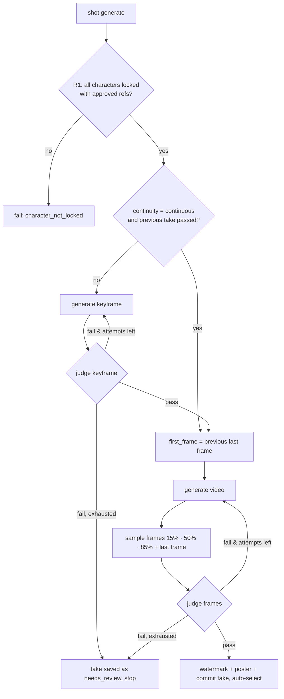

# Character consistency

Locations, props and styles follow the same rules as characters: see [elements](elements.md). Voices are locked
and verified the same way: see [dialogue](dialogue.md) (rules V1–V6).

A 40–60 minute movie is several hundred independent generations. Without enforcement, faces, hair, age and
wardrobe drift from shot to shot. Rideo treats consistency as an **invariant enforced by the server**, not
as a prompt-writing tip:

> **Invariant.** A take can be part of an approved clip, an approved cut or an export only if (a) it was
> generated from the *current locked identity* of every character in the shot, and (b) an automated judge
> verified every character against the locked references, or a human recorded an explicit, audited
> override.

## Rules

| # | Rule | Where it is enforced |
|---|---|---|
| R1 | **Lock before use.** Generating a shot fails with `character_not_locked` if any of its characters is unlocked or has no approved reference. | `ShotPipeline` precondition |
| R2 | **Locked identity is immutable.** Updating identity, wardrobe or references of a locked character fails with `character_locked`. Unlock → edit → lock increments `lock.version`. | `StoryService.updateCharacter` |
| R3 | **Deterministic conditioning.** Every keyframe and video request is compiled by pure functions (`compileKeyframeRequest`, `compileVideoRequest` in `shared/prompt`) from the locked identity: identical identity text, references in fixed view priority, stable seeds. | shared prompt compiler |
| R4 | **Verification gate.** Keyframes and video frames are judged against the references. Video generation starts only from a passing keyframe. Failures are retried with a new seed up to `maxAttempts`. | `ConsistencyGate` |
| R5 | **Continuity chaining.** A shot marked `continuity: "continuous"` starts from the last frame of the previous shot's selected, passing take (`first_frame`). | compiler + pipeline |
| R6 | **Drift detection.** A take stores the lock version of each character it was generated from. Relocking a character marks older takes **stale**, and a stale selected take blocks clip approval and export. | shared `takeStatus()` |
| R7 | **Approval gate.** Approving a clip requires every shot's selected take to be `passed` and not stale, or overridden. Export requires `timeline.consistencyVerified`. | `clip.approve`, `export.render`, workflow requirements |
| R8 | **Audited override.** `take_override {reason}` records `{actor, reason, at}` in the take and in the commit history. Agents may override only when `settings.approvals.allowAgentOverrides` is true (default false). | `StoryService.overrideTake` |
| R9 | **Fail closed.** If the judge is disabled or unavailable, takes are `unverified`, which is not `passed`. A human must review them (the UI "Mark verified" action is an override with a reason). | `ConsistencyGate` |

## Character document

```ts
type Character = {
  id: string; name: string;
  role: 'protagonist' | 'antagonist' | 'supporting' | 'minor';
  summary: string;
  identity: {                   // the identity anchor; order of fields is the order in prompts
    age: string; gender: string; ethnicity?: string; build: string; height?: string;
    face: string; hair: string; eyes: string; skin: string; distinguishingMarks?: string;
  };
  wardrobe: { id: string; name: string; description: string; default?: boolean }[];
  personality?: string; voice?: { description: string };
  references: {
    id: string; view: 'front' | 'three_quarter' | 'profile' | 'full_body' | 'expression' | 'custom';
    media: MediaRef; source: 'generated' | 'uploaded'; approved: boolean; wardrobeId?: string; createdAt: string;
    consent?: Consent;          // uploaded references: does it depict a real person, and who consented
  }[];
  seed: number;                 // uint32, fixed at creation (fnv1a of the id)
  lock: { locked: boolean; version: number; lockedAt?: string; lockedBy?: Actor; identityHash?: string };
};
```

`identityHash` is the sha256 of the canonical identity, the wardrobe and the approved reference hashes at
lock time. A take records `characterLocks: { [characterId]: version }`.

## Deterministic conditioning

The identity fragment is compiled in a fixed field order. The same character always produces the same text:

```
Mira: early 30s woman, East Asian, slender athletic build, 170 cm; face: oval face, high cheekbones,
small scar through left eyebrow; hair: jet-black straight bob, blunt fringe; eyes: dark brown, almond;
skin: light olive; distinguishing marks: silver ear cuff on right ear. Wearing: charcoal field jacket
over a white t-shirt, dark cargo trousers.
```

**Keyframe request** (image SDK, `POST /v1/images`):

```
input:  [ text: "<style header>. <shot description>. Camera: <framing>, <movement>. Characters: <identity fragments…>",
          image: <reference 1 of character A>, image: <reference 1 of character B>, … ]
params: { dimensions: project resolution, seed: shotSeed + attempt*7919, negative_prompt: BASE_NEGATIVE, output_count: 1 }
```

**Video request** (video SDK, `POST /v1/videos`):

```
input:  [ text: "<style header>. <action/motion description>. Camera: …. Characters: <identity fragments…>",
          image role=first_frame: <passing keyframe | previous shot's last frame>,
          image role=reference_image: <references…> (only if the model's limits say supports_reference_image) ]
params: { duration_seconds: clamp(shot.durationSec, model min/max), dimensions, seed, negative_prompt,
          include_audio: project setting }
```

Reference selection: per character, approved references matching the shot's wardrobe first, then by view
priority `front > three_quarter > full_body > profile > expression > custom`. The model's
`max_input_images` limit (from `GET /v1/models/limits`, cached for 5 minutes) is shared across the cast.
When the cast needs more images than the model accepts, the server composes one labelled **cast sheet**
(ffmpeg `xstack`) and sends that single image instead.

Seeds: `shotSeed = fnv1a32(shot.id) ^ Σ character.seed`, so retries are reproducible and a regenerate with
an unchanged shot starts from the same seed family.

`BASE_NEGATIVE = "different person, changed face, inconsistent outfit, age change, extra people, deformed
anatomy, text, logo, watermark"`.

## The gate



Scoring:

- The judge returns, per character and per frame, `present`, `identityScore ∈ [0,1]`, `outfitScore ∈ [0,1]`
  and `issues[]`.
- Per frame: `s = 0.75·identity + 0.25·outfit`, or `s = identity` when the shot has no wardrobe expectation.
- Per character: `present` if present in at least one sampled frame. `score` is the minimum `s` over the
  frames where the character is present, which catches mid-shot identity morphing.
- The take passes iff every expected character is present and `score ≥ threshold` (default `0.75`,
  `settings.consistency.threshold`). The report's `score` is the minimum over characters.
- Shots without characters (establishing shots) pass the identity gate trivially, with `status: passed` and
  an empty character list.

```ts
type ConsistencyReport = {
  status: 'passed' | 'failed' | 'unverified';
  judge: string;                 // e.g. "vision-llm:gemini-2.5-flash", "none"
  threshold: number; score: number; attempts: number; checkedAt: string;
  characters: { characterId: string; present: boolean; score: number; issues: string[] }[];
  frames: MediaRef[];            // evidence frames that were judged
};
```

### Judges

| Judge | When | How |
|---|---|---|
| `vision-llm` (default) | an LLM with vision is configured | One call per keyframe or take through the mm-gateway proxy. The labelled reference images and candidate frames go in as images, and the model returns strict JSON validated with zod (one repair retry). |
| `none` | `RIDEO_CONSISTENCY_JUDGE=off` or the judge keeps failing | Every take is `unverified` (fails closed, R9). |

The judge is an interface (`ConsistencyJudge`), so a face-embedding judge (for example a WASM face model)
can be added without touching the gate.

## Reference sheets

The `character.refs` job generates the views `front`, `three_quarter`, `profile` and `full_body` on a neutral
background with even studio lighting, using the identity fragment and the character seed. Every view after
the first includes the first image as an image input (image-to-image), so the face carries across views.
Users approve, regenerate or upload references. `character_from_image` (vision) fills the identity fields
from an uploaded photo.

## What the user sees

- Consistency badges on every take: passed (score), failed (issues), unverified, stale, overridden.
- The evidence frames next to the references, with the judge's issues listed.
- "Regenerate" (new attempt with a new seed), "Pick take", "Override…" (requires a reason).
- Workflow gates list every blocking take (`timeline.consistencyVerified` unmet: "shot c3-s2 take 1 is stale").
