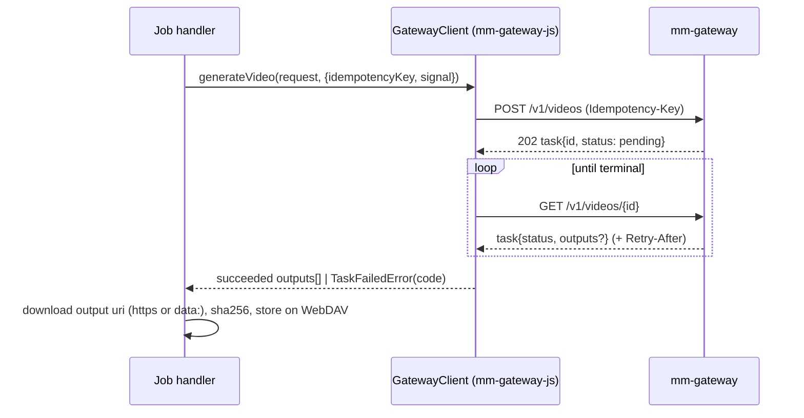

# Generation pipeline

All long-running work runs as **jobs** in an in-process queue, with job records persisted on WebDAV
(`.rideo/jobs/<jobId>.json`). Jobs report progress through live events and deliver results by committing
documents like any other actor (`system`, on behalf of the requesting actor).

## Job record

```ts
type Job = {
  id: string; projectId: string; kind: JobKind; lane: Lane;
  status: 'queued' | 'running' | 'succeeded' | 'failed' | 'cancelled';
  params: unknown; result?: unknown; error?: { code: string; message: string; retryable: boolean };
  progress: { done: number; total: number; message?: string };   // done/total in [0,1] units or counts
  attempts: number; maxAttempts: number; dedupeKey?: string; parentId?: string;
  branch: string; actor: Actor; priority: number;
  gatewayTasks: { modality: 'image' | 'video' | 'music'; id: string; status: string; idempotencyKey: string }[];
  createdAt: string; startedAt?: string; finishedAt?: string;
};
```

## Kinds and lanes

| Kind | Lane | Does |
|---|---|---|
| `screenplay.generate` | llm | describe attachments (vision), then write the screenplay, outline and draft cast |
| `screenplay.extend` | llm | write the next K outline beats as full scenes |
| `character.describe` | llm | fill identity fields from an uploaded photo |
| `character.refs` | image | generate reference views for one character |
| `clip.plan` | llm | break a scene into shots sized to model limits |
| `clip.generate` | control | enqueue `shot.generate` for every shot without a passing take and wait |
| `shot.generate` | video | the shot pipeline below |
| `batch.generate` | control | extend, plan and generate until the target length |
| `music.generate` | music | SDK music task → resource |
| `resource.process` | media | probe, proxy, poster for an uploaded or imported resource |
| `analysis.run` | media | footage analysis + suggestions |
| `edit.auto` | control | accepted suggestions → timeline |
| `timeline.assemble` | control | approved clips → timeline |
| `export.render` | media | ffmpeg render + watermark (+ browser-render finishing) |

Lane concurrency defaults: `control=4, llm=2, image=2, video=2, music=1, media=1`. Override with
`RIDEO_LANES="video=3,image=2"`. Within a lane jobs run by priority (user-initiated regenerate = 10,
pilot = 5, batch = 1), then FIFO.

## Semantics

- **Dedupe**: enqueueing with a `dedupeKey` that matches a queued or running job returns that job.
- **Cancel**: `POST /api/projects/:id/jobs/:jobId/cancel` (MCP `job_cancel`) aborts the handler's
  `AbortSignal` and cancels child jobs. Gateway tasks that are already running finish upstream, but their
  results are discarded.
- **Retry**: handler errors are classified. Retryable errors (network, HTTP 429/5xx, gateway `TaskError`
  codes `timeout`, `rate_limited`, `provider_unavailable`, `upstream_error`) back off exponentially
  (2 s · 2ⁿ, capped at 60 s) up to `maxAttempts` (default 3). Everything else fails immediately with its code.
- **Restart recovery**: on boot, queued and running records are re-enqueued. Handlers are idempotent: gateway
  creates carry `Idempotency-Key = <jobId>:<step>:<attempt>` (re-posting returns the same gateway task while
  the gateway still has it), and commits carry `meta.jobId`, so a re-run finds its earlier results and skips
  finished steps.
- **Observability**: every transition is logged with `jobId`, `projectId`, `kind`. Prometheus metrics
  `rideo_jobs_total{kind,status}` and `rideo_job_duration_seconds{kind}` are exported, and each gateway task
  id is kept in the record for cross-referencing with gateway logs.

## Gateway task lifecycle (SDK)



Polling honours `Retry-After` (clamped to 1–10 s, default 2 s). Timeouts: image 5 min, video 20 min,
music 10 min (`RIDEO_GATEWAY_TIMEOUT_*`).

## Shot pipeline (`shot.generate`)

| Step | Progress | Action |
|---|---|---|
| precheck | 0.02 | R1 (locks, approved refs), resolve models, fetch model limits (5 min cache) |
| keyframe | 0.05–0.35 | skip if continuous and the previous take passed (its last frame is the first frame); otherwise image task → download → judge → retry |
| video | 0.35–0.80 | video task with `first_frame`, references and clamped duration → download |
| verify | 0.80–0.90 | sample frames (ffmpeg) → judge → retry the video up to `maxAttempts` |
| watermark | 0.90–0.96 | embed the invisible watermark (raw frame pipe) + provenance metadata, register the id |
| proxy | 0.96–0.99 | VP9/Opus WebM proxy (≤ 640 px wide) + JPEG poster |
| commit | 1.00 | append the take to the clip (`meta.jobId`), auto-select it if it passed, set the shot status |

A shot whose attempts are exhausted still commits its best take (`needs_review`), so the user can inspect
the evidence, regenerate with changes, or override.

## Planning (`clip.plan`)

The LLM gets the scene, the cast, the style bible and the video model limits, and returns shots:
`{description, action, camera: {framing, movement}, characterIds, wardrobe, dialogue, durationSec,
continuity}`. The planner then **normalizes** the result deterministically:

- clamp each duration into `[min_duration_seconds, max_duration_seconds]` of the video model (default
  `[4, 10]` when the limits are unknown);
- split shots longer than the maximum into continuous sub-shots;
- scale durations so the clip lands within `[10, 180]` s and near the scene estimate;
- drop unknown character ids, and make the first shot of a clip a `cut`.

## Batch generation (`batch.generate`)

```
target = settings.targetDurationSec
loop:
  planned = Σ planned clip durations
  if planned ≥ 0.97·target or (outline exhausted and story ended): stop planning
  if the next outline beat has no written scene: screenplay.extend(next 3 beats)
  clip.plan(next scene)
  enqueue clip.generate(clip)   // at most 2 clip jobs in flight (lookahead)
  stop if generations started by this batch would exceed settings.batch.maxGenerations
wait for in-flight clip jobs
```

- Clips are generated **in order**, because continuity chaining and the story extension depend on earlier
  clips.
- **Model pinning**: when the pilot is approved, the image and video model ids reported by the gateway in
  the pilot takes (`task.model`) are written to `settings.models`, so auto-routing cannot silently switch
  backends mid-movie.
- Progress reports planned seconds versus target, and shots done, failed and awaiting review. The UI shows
  an ETA from moving averages of shot duration.
- Pause and resume: `batch_pause` cancels the batch job (in-flight shot jobs finish); `batch_resume`
  enqueues a new batch that continues from the snapshot.
