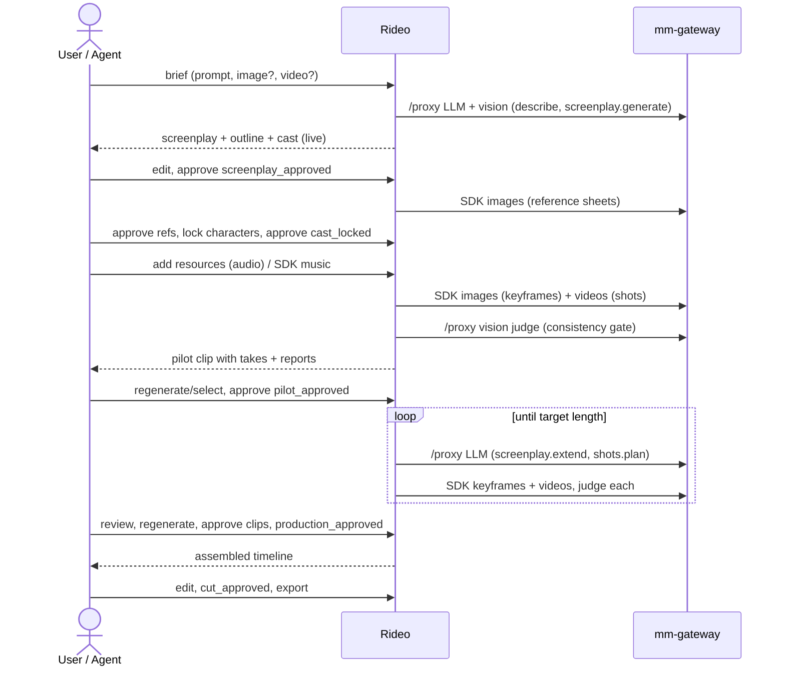

# Workflows

Rideo's two product workflows are **declarative stage machines** defined as data in
`packages/shared/src/workflow/definitions.ts`. One evaluator (`evaluateWorkflow(definition, snapshot)`)
computes the current stage, gate status and unmet requirements from the project snapshot. The UI stepper,
the REST API, the MCP tools and the job automation all read that evaluation, so none of them has its own
idea of "where the project is".

```ts
type WorkflowDefinition = { kind: 'story' | 'edit'; stages: StageDef[] };
type StageDef = {
  id: StageId;
  title: string;
  gate?: { id: GateId; requirements: RequirementId[]; tag: string };   // approving the gate tags the commit
  autoOnEnter?: AutoActionId[];   // run when the stage is entered and project.settings.autopilot is true
};
```

- Stages are ordered. `project.workflow.stage` is the current stage. `project.workflow.approvals[gateId]`
  records `{at, actor, commit}`.
- `approve(gateId)` succeeds only when every requirement is satisfied. It then records the approval, tags
  the commit (`<tag>`, or `<tag>-2`… when the tag already exists), and moves to the next stage.
- `reopen(stageId)` moves back to an earlier stage and clears later approvals (the history keeps them). Use
  it to rewrite the screenplay after production has started, for example.
- Requirements are **named predicates** over the snapshot (the catalogue below). They are pure functions in
  shared code, so the UI can show exactly what is missing ("2 characters are not locked").
- Approvals by agents are allowed when `project.settings.approvals.allowAgents` is true (default). Every
  approval is attributed to its actor in the history.
- Actions are not blocked by stage. You can regenerate a shot while editing, for example. Safety-critical
  preconditions (character locks, consistency) are enforced by the services in every stage.

## Story → movie (`kind: story`)

| # | Stage | What happens | Gate (requirements) | Auto on enter (autopilot) |
|---|---|---|---|---|
| 1 | `brief` | The user writes a short prompt and optionally attaches reference images and videos. Sets target length (default 2700 s, UI presets 40/50/60 min), pilot length (10–180 s), aspect ratio and style hints. | `brief_submitted`: `brief.hasPrompt` | – |
| 2 | `screenplay` | A `screenplay.generate` job describes the attachments (vision), then writes the title, style bible, a **full-length outline** paced to the target length, the first scenes (covering at least the pilot length), and a draft cast. The user fine-tunes everything. | `screenplay_approved`: `screenplay.hasScenes`, `characters.nonEmpty`, `screenplay.outlineCoversTarget` | `screenplay.generate` |
| 3 | `cast` | For each character: generate reference sheets (front, three-quarter, profile, full body) or upload references, edit identity fields, approve references, **lock**. | `cast_locked`: `characters.allLocked`, `characters.allHaveApprovedRefs` | `characters.generateRefs` (unlocked characters without refs) |
| 4 | `resources` | Optional extra material: voice-over or music audio, images, videos; generate music through the SDK. | `resources_ready`: – (can be approved empty) | – |
| 5 | `pilot` | Plan clip 1 (shots sized to model limits) and generate it. The user edits shot prompts, regenerates shots or picks takes, and approves. The approved pilot fixes the look for the rest of the production. | `pilot_approved`: `clips.pilotApproved` | `clip.plan` + `clip.generate` for clip 1 |
| 6 | `production` | A `batch.generate` job writes the remaining scenes from the outline, plans the clips and generates them in order until the planned length reaches the target. The user reviews, regenerates any shot or clip, and approves clips. | `production_approved`: `clips.allApproved`, `duration.targetReached` | `batch.generate` |
| 7 | `edit` | The timeline is assembled from approved clips (selected takes, scene transitions, music bed, optional dialogue captions). The user edits it in the WebCodecs editor. | `cut_approved`: `timeline.nonEmpty`, `timeline.consistencyVerified` | `timeline.assemble` |
| 8 | `export` | The browser renders the timeline (ffmpeg.wasm or WebCodecs, in chunks) and uploads it; the server watermarks and publishes it. | – (terminal; done when `exports.anySucceeded`) | – |

"Go on…" after production means editing and exporting. At any point you can reopen an earlier stage, or
tag and branch the history to try an alternative.



### Target length arithmetic

- Planned length = sum of the clips' planned shot durations.
- `duration.targetReached` holds when the approved length is at least 97% of `settings.targetDurationSec`,
  or when the outline is complete (every beat written and approved) and the story has ended.
- The batch job never plans beyond `targetDurationSec × 1.05`. It stops early when the budget cap
  `settings.batch.maxGenerations` would be exceeded, and it can be paused, resumed and cancelled.

## Footage → edit (`kind: edit`)

| # | Stage | What happens | Gate | Auto on enter |
|---|---|---|---|---|
| 1 | `ingest` | Upload one or more source videos (UI upload, the WebDAV inbox, or MCP `resource_add`). The uploading browser probes each file and makes its poster with ffmpeg.wasm; inbox and MCP imports get a `media.process` editor job. The UI's *Analyze footage* approves the gate and starts the analysis of the source video. | `source_ready`: `resources.hasSourceVideo` | – |
| 2 | `analysis` | The browser runs `analysis.signals` with ffmpeg.wasm: scenes (`select='gt(scene,0.3)'` + `showinfo`), silences (`silencedetect`), black segments (`blackdetect`), loudness (`ebur128`), scene thumbnails and, when speech-to-text is configured, a speech track. The server's `analysis.suggest` job then transcribes (optional) and asks the vision LLM for a summary and suggestions. Deterministic rule-based suggestions (cut black, tighten long silences, fade in/out) are always produced, even without an LLM. The user accepts or rejects each suggestion. | `suggestions_reviewed`: `analysis.completed` | `analysis.start` |
| 3 | `edit` | **Auto edit** applies the accepted suggestions to build the timeline (kept segments, transitions, titles, captions, speed, music). The user fine-tunes it in the editor. | `cut_approved`: `timeline.nonEmpty` | `edit.auto` |
| 4 | `export` | Browser render (ffmpeg.wasm or WebCodecs), watermarked by the server. | – | – |

## Requirement catalogue

| Id | Satisfied when |
|---|---|
| `brief.hasPrompt` | `project.brief.prompt` has at least 3 non-space characters |
| `screenplay.hasScenes` | the screenplay exists with at least one written scene |
| `screenplay.outlineCoversTarget` | the sum of outline beat durations is at least 90% of the target length |
| `characters.nonEmpty` | at least one character document |
| `characters.allLocked` | every character has `locked: true` |
| `characters.allHaveApprovedRefs` | every character has at least one reference with `approved: true` |
| `clips.pilotApproved` | the clip with `index: 0` has `status: approved` |
| `clips.allApproved` | at least one clip, and every clip is `approved` |
| `duration.targetReached` | see "Target length arithmetic" |
| `timeline.nonEmpty` | the primary video track has at least one item |
| `timeline.consistencyVerified` | every timeline item that references a take points at a take whose consistency `passed` or that has an `override` |
| `resources.hasSourceVideo` | at least one resource with `kind: video`, `role: source` |
| `analysis.completed` | at least one analysis document with `status: completed` |
| `exports.anySucceeded` | at least one export with `status: succeeded` |

## Auto-action catalogue

| Id | Effect |
|---|---|
| `screenplay.generate` | enqueue `screenplay.generate` if there is no screenplay yet |
| `characters.generateRefs` | enqueue `character.refs` for each unlocked character without references |
| `clip.plan` / `clip.generate` | plan clip 0 from scene 0 if missing, then enqueue its generation |
| `batch.generate` | enqueue `batch.generate` if none is active |
| `timeline.assemble` | assemble the timeline from approved clips if the timeline is empty |
| `analysis.start` | start an analysis (an `analysis.signals` editor job) for the newest source video without one |
| `edit.auto` | build the timeline from accepted suggestions if the timeline is empty |

Auto actions are idempotent. They check the snapshot before enqueueing and use deterministic job dedupe
keys, so a repeated stage entry or a restart does not duplicate work.
